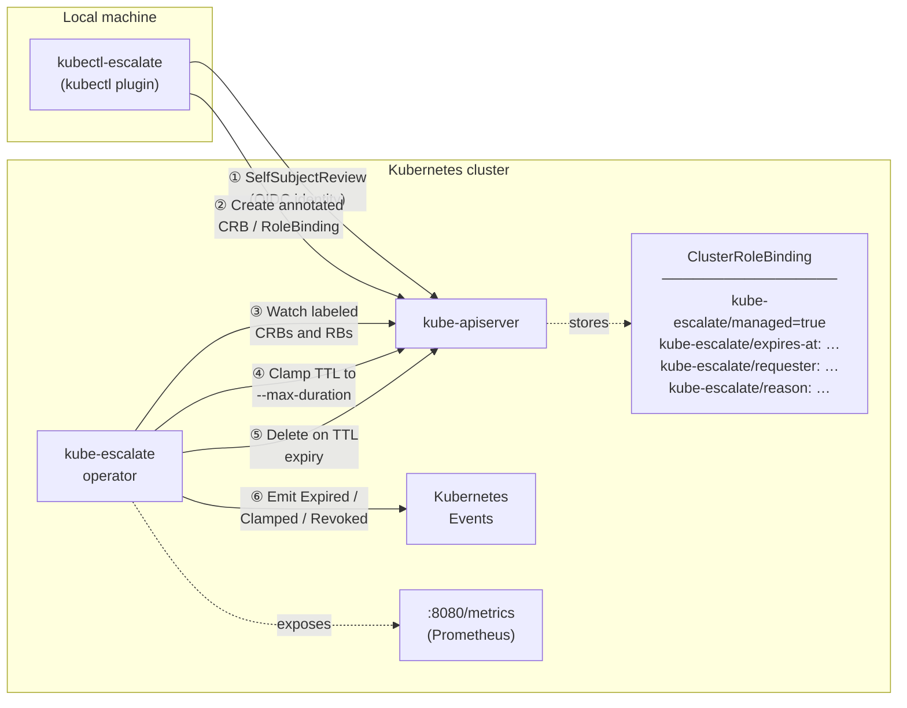

# Architecture

## Component diagram



## Escalation lifecycle

1. **Plugin** calls `AuthenticationV1().SelfSubjectReviews().Create()`.
   The API server populates `Status.UserInfo.Username` and `Status.UserInfo.Groups`
   from the validated OIDC token — this value cannot be forged by the caller.

2. **Plugin** creates a `ClusterRoleBinding` (or `RoleBinding` for
   `--namespace`) annotated with the expiry timestamp, requester identity, and
   reason. The binding immediately grants the requested role.

3. **Operator** watches all `ClusterRoleBinding` and `RoleBinding` objects
   labelled `kube-escalate/managed=true` via a controller-runtime predicate
   filter. Unmanaged bindings are never enqueued.

4. On first reconcile, if `kube-escalate/expires-at` exceeds
   `CreationTimestamp + --max-duration` (default `24h`), the operator treats
   `CreationTimestamp + --max-duration` as the effective expiry for deletion
   purposes and emits a `Warning/EscalationClamped` event — enforced
   regardless of what the plugin/client requested, since there is no
   admission webhook to reject the request up front. **The `expires-at`
   annotation itself is never rewritten**: any `Update` to a managed binding
   — even one only touching an unrelated annotation — is validated by the API
   server as if granting the binding's RoleRef, so an operator whose own
   ServiceAccount doesn't hold that role's permissions would be rejected;
   only pure finalizer-only updates are exempt from that check. Practical
   effect: `kubectl escalate status` may show the originally requested TTL
   even when it's actually going to be cut short — check for an
   `EscalationClamped` event for the real effective expiry.

5. On each subsequent reconcile the operator parses `kube-escalate/expires-at`:
   - **TTL elapsed** → delete binding, emit `Warning/EscalationExpired` event,
     record Prometheus metrics.
   - **TTL not elapsed** → requeue exactly at `expiresAt + 1s`; no polling
     window, no grace period.

6. The user's elevated access is active for exactly the (possibly clamped) duration.

---

## Security model

| Property | Enforcement |
|---|---|
| **Tamper-proof identity** | Requester is read from `SelfSubjectReview` — populated by the API server, never from CLI arguments |
| **Automatic expiry** | Reconciler requeues at the exact expiry instant; no polling gap |
| **Least-privilege operator** | ClusterRole grants only `get/list/watch/update/patch/delete` on `clusterrolebindings` and `rolebindings` (update/patch needed for the cleanup finalizer) — the operator can never *create* a binding |
| **TTL ceiling** | The operator clamps any requested `expires-at` beyond `--max-duration` (default `24h`) on first reconcile — enforced server-side even though there is no admission webhook |
| **No admission webhook** | No availability dependency on the operator path; if the operator restarts, existing bindings remain until it reconciles again |
| **No CRD** | Uses standard `rbac.authorization.k8s.io/v1` objects — works on any Kubernetes 1.26+ cluster without CRD installation |
| **No database** | All state lives in Kubernetes etcd; no external store to secure or back up |
| **Audit trail** | Every expiry and revocation emits a Kubernetes Event; requester identity and reason are stored as annotations on the binding itself |

---

## Threat model — what this does and does not protect against

kube-escalate addresses **standing privilege and accident**: credentials that
are cluster-admin around the clock and get stolen, reused in a script, or used
carelessly — and the inability to answer *"who held admin last Tuesday, and
why?"*.

It does **not** contain a user who is authorised to escalate and chooses to
abuse it. When the target role is `cluster-admin`, the time bound is only
enforced against someone who cooperates with it. During the escalation window
that user is a full cluster admin and can therefore delete any admission policy
constraining them, `update` their own binding's `expires-at` annotation, strip
the cleanup finalizer, uninstall the operator, or simply create an ordinary
permanent ClusterRoleBinding. None of that is preventable from inside the
cluster once cluster-admin has been granted — by this or by any other
JIT tool.

What follows from that:

- **Who may escalate is the real security decision**, not the TTL. Adding
  someone to the group that may reach `cluster-admin` is equivalent to handing
  them a permanent admin kubeconfig, plus an audit trail.
- **Ship the logs off-cluster.** Kubernetes Events are short-lived (~1h) and an
  escalated user can delete them. Exported logs cannot be retracted.
- **Alert on tamper signals**: mutation of the operator Deployment, of any
  admission policy governing escalation, or of a managed binding's annotations.
- **Prefer narrower targets.** A role that cannot edit RBAC or admission
  configuration *is* genuinely bounded by the TTL. `cluster-admin` is not.

---

## Bootstrap order

The following must exist before the first escalation can be created:

```
1. Operator deployed (helm install)
   └─ Creates: ServiceAccount, ClusterRole, ClusterRoleBinding, Deployment

2. User has RBAC to use the plugin
   └─ Needs: create on selfsubjectreviews
             create on clusterrolebindings (and/or rolebindings)

3. Target role exists in the cluster
   └─ e.g. cluster-admin (built-in) or a custom ClusterRole
      The plugin only binds existing roles — it never creates them.
```

The plugin does **not** require the operator to be running at escalation time.
If the operator is down, the binding is created but will not be automatically
deleted until the operator restarts and reconciles. This is a deliberate
trade-off: escalation availability is prioritised over expiry precision.
