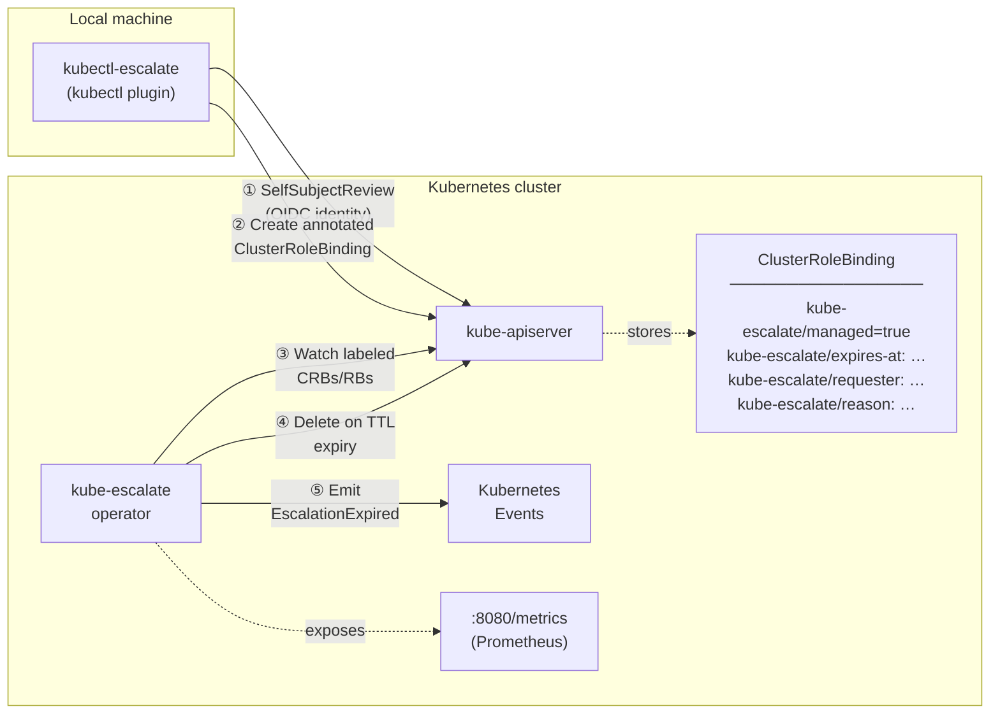

# Architecture

## Component diagram



## Escalation lifecycle

1. **Plugin** calls `AuthenticationV1().SelfSubjectReviews().Create()`.
   The API server populates `Status.UserInfo.Username` and `Status.UserInfo.Groups`
   from the validated OIDC token — this value cannot be forged by the caller.

2. **Plugin** creates a `ClusterRoleBinding` (or `RoleBinding` for
   `--namespace`) annotated with the expiry timestamp, requester identity, and
   reason. The binding immediately grants the requested role.

3. **Operator** watches all objects labelled `kube-escalate/managed=true` via a
   controller-runtime predicate filter. Unmanaged CRBs are never enqueued.

4. On each reconcile the operator parses `kube-escalate/expires-at`:
   - **TTL elapsed** → delete binding, emit `Warning/EscalationExpired` event,
     record Prometheus metrics.
   - **TTL not elapsed** → requeue exactly at `expiresAt + 1s`; no polling
     window, no grace period.

5. The user's elevated access is active for exactly the requested duration.

---

## Security model

| Property | Enforcement |
|---|---|
| **Tamper-proof identity** | Requester is read from `SelfSubjectReview` — populated by the API server, never from CLI arguments |
| **Automatic expiry** | Reconciler requeues at the exact expiry instant; no polling gap |
| **Least-privilege operator** | ClusterRole grants only `get/list/watch/delete` on `clusterrolebindings` and `rolebindings` — the operator can never *create* a binding |
| **No admission webhook** | No availability dependency on the operator path; if the operator restarts, existing bindings remain until it reconciles again |
| **No CRD** | Uses standard `rbac.authorization.k8s.io/v1` objects — works on any Kubernetes 1.26+ cluster without CRD installation |
| **No database** | All state lives in Kubernetes etcd; no external store to secure or back up |
| **Audit trail** | Every expiry and revocation emits a Kubernetes Event; requester identity and reason are stored as annotations on the binding itself |

---

## Bootstrap order

The following must exist before the first escalation can be created:

```
1. Operator deployed (helm install)
   └─ Creates: ServiceAccount, ClusterRole, ClusterRoleBinding, Deployment

2. User has RBAC to use the plugin
   └─ Needs: create on selfsubjectreviews
             create on clusterrolebindings (and/or rolebindings)

3. Target role exists in the cluster
   └─ e.g. cluster-admin (built-in) or a custom ClusterRole
      The plugin only binds existing roles — it never creates them.
```

The plugin does **not** require the operator to be running at escalation time.
If the operator is down, the binding is created but will not be automatically
deleted until the operator restarts and reconciles. This is a deliberate
trade-off: escalation availability is prioritised over expiry precision.
